# Chinese Traffic Signs and Signals Detection
## Introduction
This project target is to train a model to detect Chinese traffic signs and signals with [Tensorflow object detection API](https://github.com/tensorflow/models/tree/master/research/object_detection).

Only 13 classes Chinese traffic signs and signals have been trained to detect in this project for limited dataset reason.
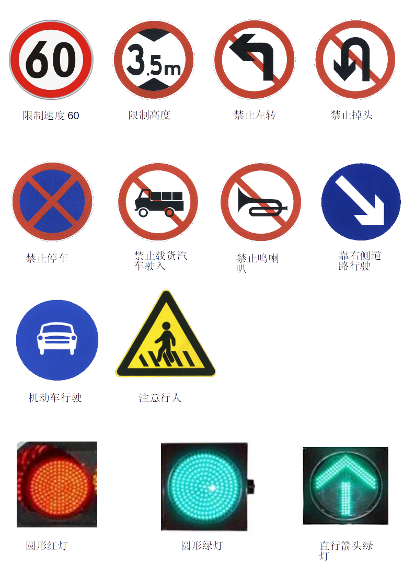

The model is ssd inception model and trained about 30000.

It is clear that Chinese traffic detection can not meet requirements with limited dataset and transfer learning.

More methods will be carried to improve traffic signs detections for self driving cars. 

## Performance
### Evaluation metrics
The commonly used mAP metric for evaluating the quality of object detectors, computed according to the protocol of the PASCAL VOC Challenge 2007. The protocol is available [here](http://host.robots.ox.ac.uk/pascal/VOC/voc2007/devkit_doc_07-Jun-2007.pdf).

A [reference](http://www.cnblogs.com/sddai/p/5696870.html) for metrics concept.

`metrics_set='pascal_voc_metrics'`
should be added into config file `eval_config`.

### mPA for total and separate class
* mAP for total

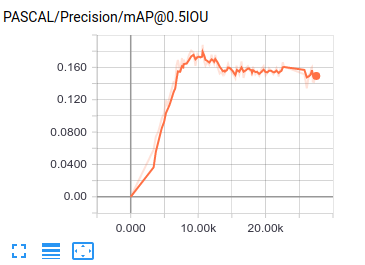
* mAP for speed limit 60

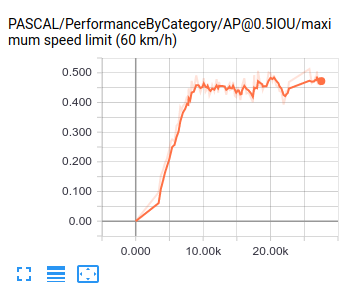
* mAP for no left turn

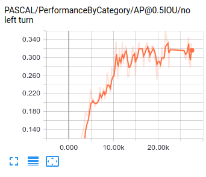
* mAP for red light

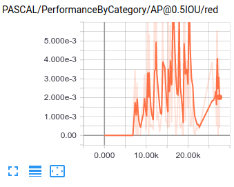
### example Images
* detect right  
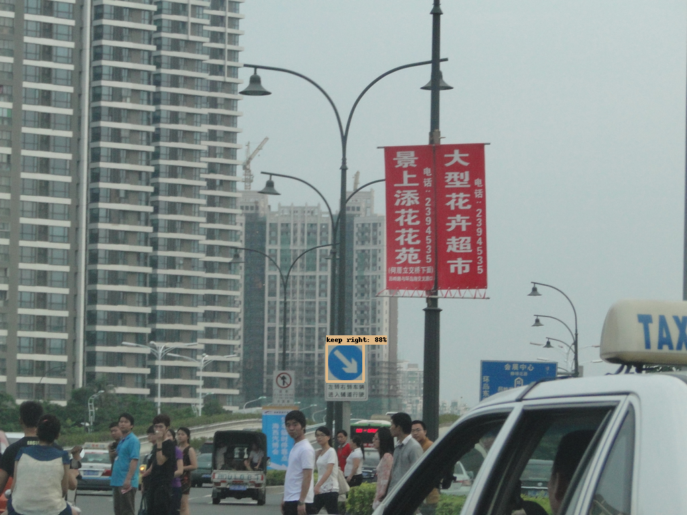
* detect empty images
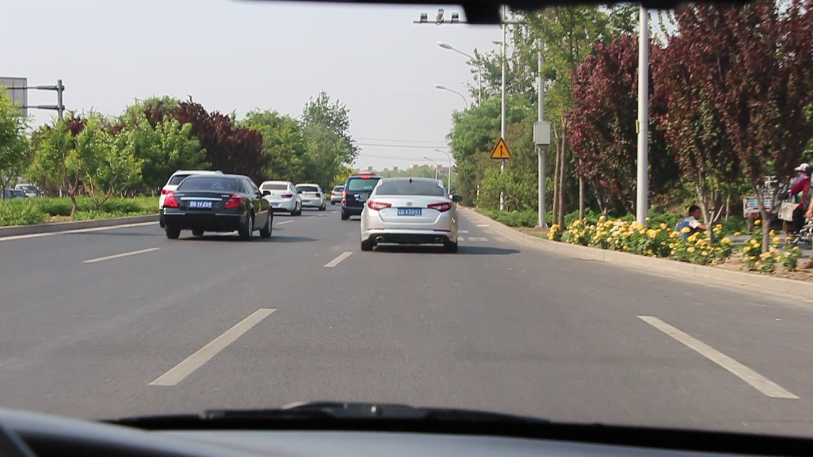
* detect wrong
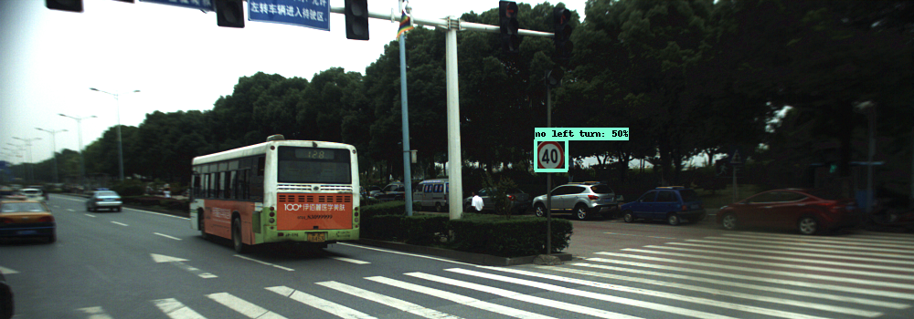
* missing detect
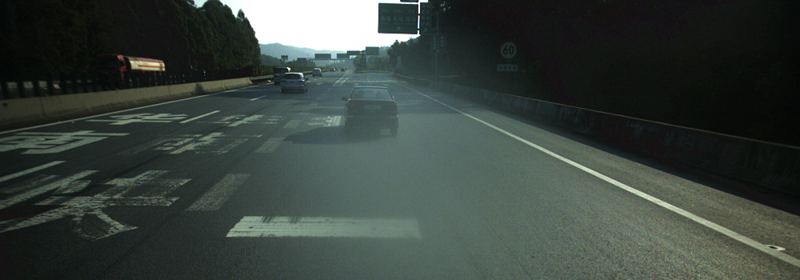

## Data
There are several data sources for Chinese traffic signs and signals:
* [NSFC](ccvai.xjtu.edu.cn)
* [CSUST Chinese Traffic Sign Detection Benchmark](https://github.com/csust7zhangjm/CCTSDB)
* [TrafficSignData_Norm by WUHAN University](https://github.com/joker970327/TrafficSignData_Norm)

In order to get a diversified dataset, we filtered and combined the above 3 dataset into a new dataset with almost 1200 images.
The new dataset class distribution is shown below.
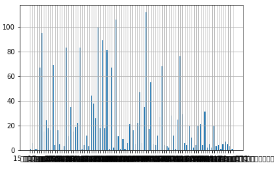

There are total 12360 traffic signs for new dataset.

the numbers of classes are shown blew:
```
禁38-限制速度60        112
禁35-限制高度          106
禁22-禁止向左转弯       100
圆形绿灯               95
禁28-禁止掉头          89
示29-机动车行驶         83
示7-靠右侧道路行驶       83
禁31-禁止停车          81
警10-注意行人          76
直行箭头绿灯            69
禁7-禁止载货汽车驶入     68
圆形红灯               67
禁33-禁止鸣笛           67
禁38-限制速度80        55
禁38-限制速度40        47
禁16-禁止非机动车进入     44
禁2-减速让行           38
禁38-限制速度50        35
示31-非机动车行驶       35
警5-上陡坡            31
```

We ignore these classes which classes numbers less than 60 and stratifiedshufflesplit into train, val and test.
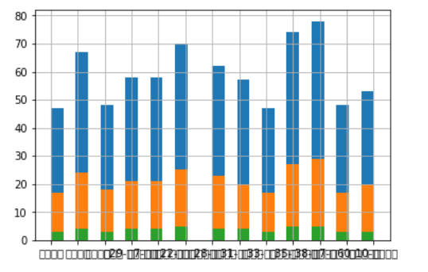
```
禁38-限制速度60     112
禁35-限制高度       106
禁22-禁止向左转弯     100
圆形绿灯            95
禁28-禁止掉头        89
示7-靠右侧道路行驶      83
示29-机动车行驶       83
禁31-禁止停车        81
警10-注意行人        76
直行箭头绿灯          69
禁7-禁止载货汽车驶入     68
禁33-禁止鸣笛        67
圆形红灯            67
```

## Resources
[road signs in China](https://en.wikipedia.org/wiki/Road_signs_in_China)

[北京市公安局公安交通管理局图解交通标识](http://www.bjjtgl.gov.cn/jgj/jgbz/101994/index.html)

[A Real-Time Chinese Traffic Sign Detection Algorithm Based on Modified YOLOv2](http://www.mdpi.com/1999-4893/10/4/127/htm)

[Traffic-Sign Detection and Classification in the Wild](http://cg.cs.tsinghua.edu.cn/traffic-sign/)

[matlab traffic signs paper](https://cn.mathworks.com/content/dam/mathworks/mathworks-dot-com/company/events/conferences/automotive-conference-stuttgart/2015/proceedings/traffic-sign-recognition-for-driver-assistance-systems.pdf)

## Licenses
The specific code is distributed under MIT License.
